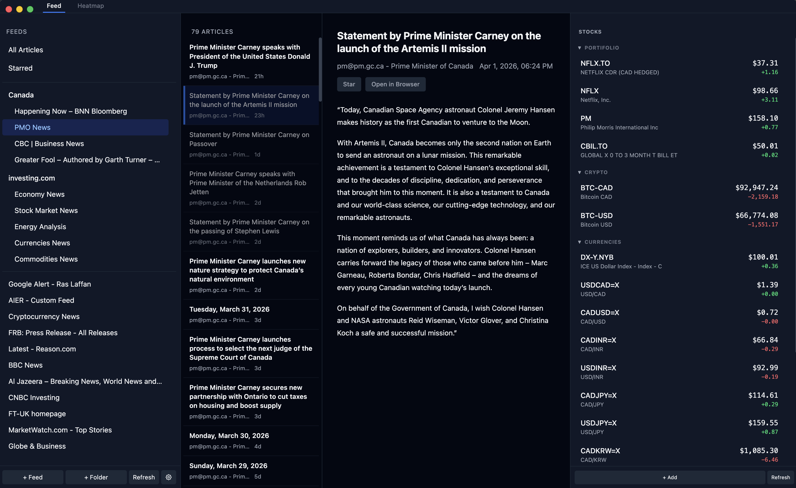
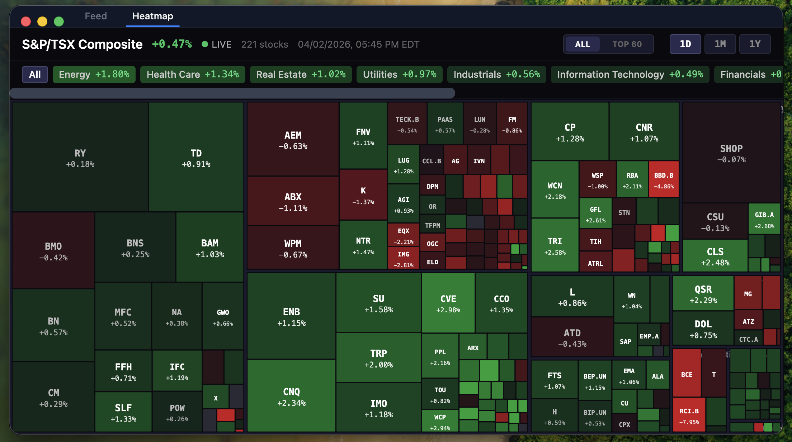

# Hoffman Reader

A privacy-first macOS desktop app for reading RSS/Atom feeds and tracking stocks. Zero telemetry — the only network calls are to your RSS feeds and Yahoo Finance.


 

 </br>


## Features

- **RSS Reader** — Add feeds by URL, organize into folders, clean reading view
- **Stock Tracker** — Side panel watchlist with live quotes from Yahoo Finance
- **TSX Heatmap** — Full S&P/TSX Composite treemap (222 stocks) with 1D/1M/1Y performance, sector filtering, and Top 60 view
- **Intelligent Responsive UI** — Panels automatically shrink or collapse as you resize the window. The stock panel transforms into a compact ticker view.
- **Backup & Restore** — Export your entire configuration (feeds, folders, stocks) to a portable `.json` file and import it back anytime.
- **Keyboard-driven** — `⌘+j`/`k` navigate, `⌘+r` refreshes, `⌘+⇧+S` stars, `⌘+⇧+T` adds stock, `⌘+⇧+F` adds feed, `⌘+⇧+D` adds folder
- **Offline-first** — All data in local SQLite, panels degrade gracefully without network
- **Dark mode** — Follows macOS system appearance automatically
- **Private** — No analytics, no tracking, no external resources, strict CSP

## Usage

### Managing Feeds & Stocks
- **Add Feed**: Press `⌘+⇧+F` or use the sidebar "+" button.
- **Add Folder**: Press `⌘+⇧+D` or use the sidebar folder icon.
- **Add Stock**: Press `⌘+⇧+T` or use the "+ Add Stock" button in the right panel.
- **TSX Heatmap**: Toggle between all 222 stocks or the Top 60 by weight. Filter by sector using the top bar. Toggle between daily, monthly, and yearly performance.
- **Export/Import**: Open Settings (⚙ icon in sidebar) to backup your configuration to a `.json` file. This makes it easy to sync between machines or keep a safe copy of your reading list.

### Responsive Panels
The UI is designed to stay functional even in narrow windows:
- **Stock Panel**: When the panel is narrow (< 160px), it collapses into a "Ticker" view. Click a ticker to toggle between price change ($) and percentage (%). Click the symbol to see full details in a hover popup (dismiss with `Esc`).
- **Sidebar**: Automatically hides when the window is narrow, maximizing space for articles.
- **Navigation**: In narrow views, a "Back" button appears in the article view to return to the list.

## Keyboard Shortcuts

| Key | Action |
|-----|--------|
| `⌘+j` / `⌘+k` | Navigate to next/previous article |
| `⌘+r` | Refresh all feeds |
| `⌘+⇧+S` | Toggle star (bookmark) |
| `⌘+⇧+T` | Toggle "Add Ticker" form |
| `⌘+⇧+F` | Toggle "Add Feed" form |
| `⌘+⇧+D` | Toggle "Add Folder" form |
| `Esc` | Close popups or settings |

*Note: Use `Ctrl` instead of `⌘` on Windows/Linux.*

## Why Hoffman Reader?

Most news readers today are filled with tracking pixels, targeted ads, and "recommended content" algorithms. **Hoffman Reader** is different. It's a tool for intentional reading. No one knows what you read, what stocks you watch, or how often you check them. It's just you and your sources.

**Built with ❤️ for privacy enthusiasts.** If you like this project, feel free to share it with others who value digital autonomy.

## Installation

### Prerequisites
- **Node.js 20+**
- **npm**

### Setup
1. Clone the repository
2. Install dependencies:
   ```bash
   npm install
   ```
3. Rebuild native modules (SQLite):
   ```bash
   npm run postinstall
   ```

## Development

To start the development environment:
```bash
npm run dev
```

This builds the main process, then starts three concurrent processes:
1. TypeScript compiler watching `src/main/`
2. Vite dev server for the React renderer
3. Electron loading from localhost

To run the automated test suite:
```bash
npm run test
```

To run TypeScript type checking across both processes:
```bash
npm run typecheck
```

## Packaging

### macOS (DMG)
To generate a production-ready `.dmg` file:
```bash
npm run build          # Runs tests, builds main and renderer
npm run dist           # Packages into a .dmg in the /release folder
```

The resulting file will be in `release/Hoffman Reader-X.X.X.dmg`.

*Note: Since these builds are usually unsigned, you may need to right-click the app and select "Open" the first time you run it to bypass macOS Gatekeeper.*

### Windows & Linux
While Hoffman Reader is designed with a macOS-native aesthetic (hidden title bar, etc.), it is compatible with Windows and Linux. To package for these platforms, you can use the following commands:

**Windows:**
```bash
npx electron-builder --win portable  # Creates a portable .exe
```

**Linux:**
```bash
npx electron-builder --linux AppImage # Creates an AppImage
```

## Architecture

```
Main Process (Node.js)               Renderer (React + Vite)
┌─────────────────────────────┐      ┌──────────────────────────────────────┐
│  SQLite                      │      │  Tab: Feed                           │
│  ├─ feeds / articles         │      │  ├─ RssPanel (sidebar + articles)    │
│  ├─ watchlist / groups       │      │  └─ StockPanel (watchlist + quotes)  │
│  └─ settings                 │      │                                      │
│                               │◄────►│  Tab: Heatmap                       │
│  RSS fetching (fast-xml)     │ IPC  │  └─ TSXHeatmap (D3 treemap)         │
│  Stock quotes (yahoo-finance) │      └──────────────────────────────────────┘
│  Heatmap data                │                     ▲
│  ├─ BlackRock CSV (holdings) │                     │ contextBridge
│  └─ Yahoo Finance (quotes)   │               preload.ts
└─────────────────────────────┘             window.api.*
```

All communication between processes goes through `contextBridge` and typed IPC handlers. The renderer never has access to Node APIs.

## Tech Stack

| Layer | Technology |
|-------|-----------|
| Shell | Electron |
| UI | React 19 |
| Language | TypeScript (strict) |
| Styling | Tailwind CSS v4 |
| Database | better-sqlite3 (SQLite, WAL mode) |
| RSS | fast-xml-parser |
| Stocks | yahoo-finance2 |
| Heatmap | D3.js + csv-parse |
| Bundler | Vite |
| Packaging | electron-builder |

## Privacy

- Zero telemetry, analytics, or crash reporting
- Only outbound network: RSS feed URLs you configure + Yahoo Finance API
- Strict Content Security Policy — no inline scripts, no external resources
- All assets bundled locally, no CDNs
- Data stored locally in SQLite
